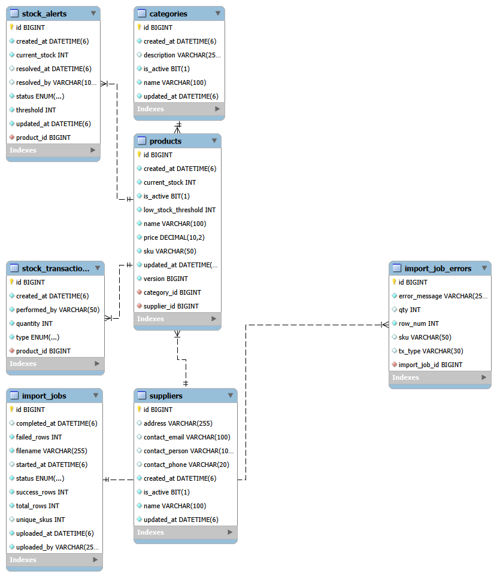
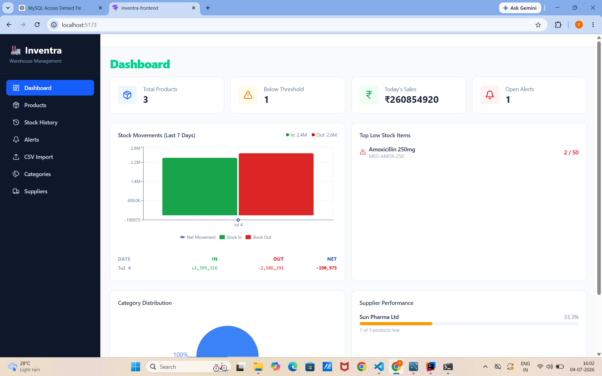
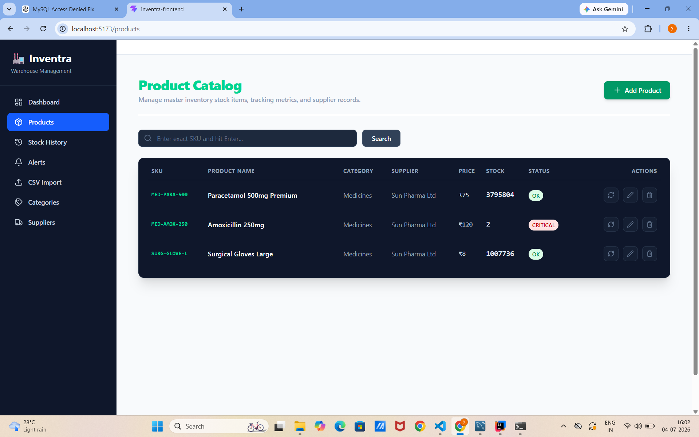
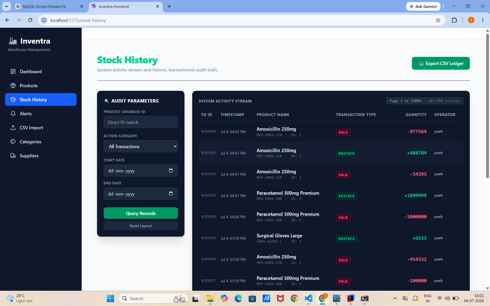
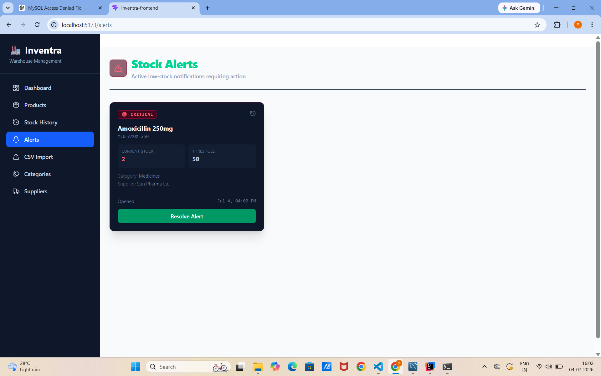
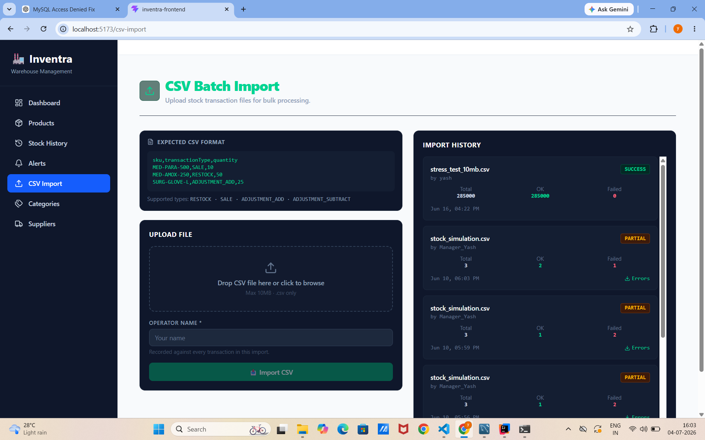
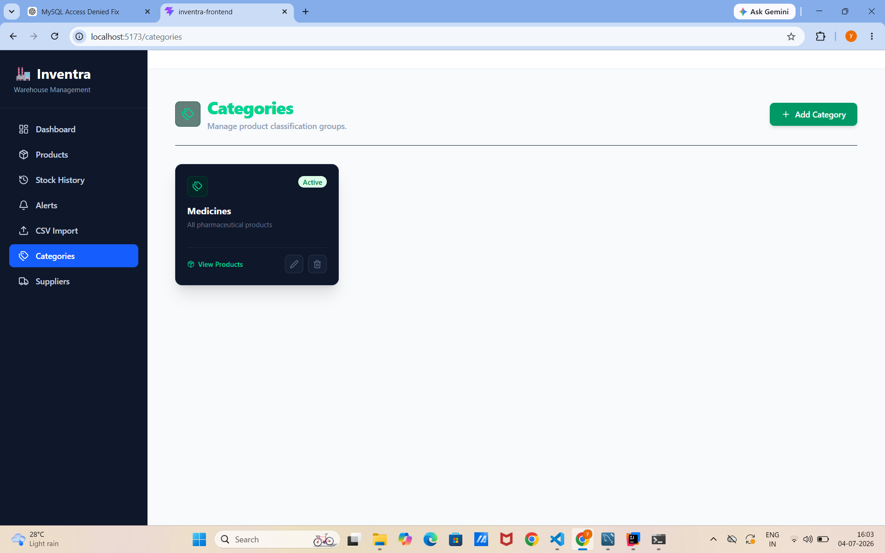
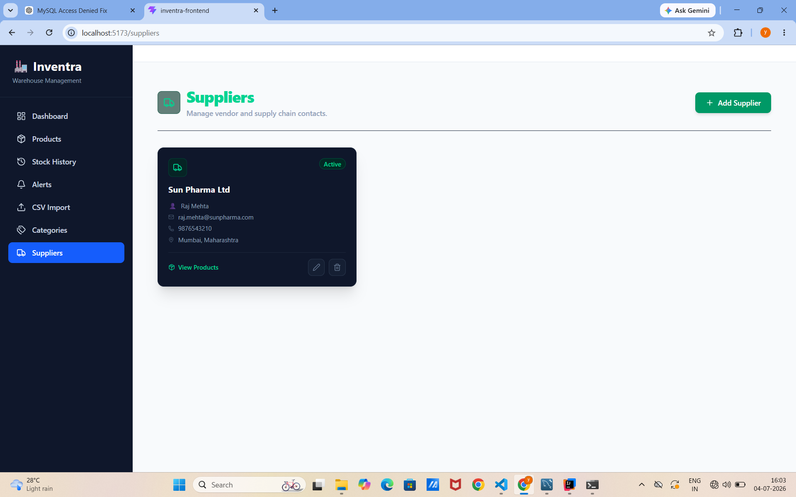

<div align="center">

# 📦 Inventra

### Enterprise Inventory & Warehouse Management System

A modern full-stack Inventory Management System built with **Spring Boot**, **React**, and **MySQL** that enables organizations to efficiently manage products, suppliers, categories, inventory transactions, low-stock alerts, dashboard analytics, and bulk CSV imports while maintaining a complete audit trail of every inventory movement.


</div>

---

# 📖 Overview

Inventra is a production-inspired inventory management application designed to simplify warehouse operations while ensuring inventory accuracy and complete transaction traceability.

Instead of directly modifying product stock, every inventory movement is recorded as a dedicated stock transaction, creating a permanent audit trail that improves inventory transparency and business reliability.

The application also supports bulk CSV imports with detailed error tracking, allowing administrators to import large inventories efficiently while identifying invalid records without affecting valid data.

---

# 🎯 Problem Statement

Many inventory systems only provide basic CRUD functionality, making it difficult to:

- Track inventory history
- Monitor stock movements
- Detect low-stock products
- Manage suppliers efficiently
- Process bulk inventory updates
- Audit inventory changes
- Prevent accidental stock manipulation

Inventra addresses these challenges by combining inventory management with transaction tracking, analytics, alerting, and batch processing.

---

# ✨ Key Features

### 📦 Product Management

- Create products
- Update product details
- Soft delete products
- SKU validation
- Product search
- Pagination

---

### 🏷 Category Management

- Add categories
- Update categories
- Delete categories
- Product categorization

---

### 🚚 Supplier Management

- Supplier registration
- Contact management
- Supplier-product relationship

---

### 🔄 Inventory Transaction Engine

Every stock movement generates a transaction.

Supported operations include:

- Initial Stock
- Restock
- Sale
- Manual Adjustment

---

### ⚠ Low Stock Alerts

Automatically identifies products that fall below their configured threshold and displays them on the dashboard.

---

### 📥 CSV Bulk Import

Import hundreds of inventory records through CSV files.

Features include:

- Batch processing
- Validation
- Import history
- Error tracking
- Partial success handling

---

### 📊 Dashboard

Provides warehouse insights including:

- Total Products
- Total Categories
- Total Suppliers
- Low Stock Items
- Inventory Statistics

---

### 📜 Audit Trail

Every inventory operation is permanently stored inside the Stock Transaction table for complete traceability.

---

# 🚀 Project Highlights

- Enterprise-inspired architecture
- Layered Spring Boot design
- RESTful APIs
- DTO-based communication
- Optimistic Locking
- Global Exception Handling
- Batch CSV Import
- Import Job Tracking
- Low Stock Monitoring
- Transaction-based Inventory Updates
- Soft Delete Strategy
- Responsive React UI

---

# 🌟 Why Inventra?

Unlike traditional CRUD inventory systems, Inventra follows production-oriented software engineering practices.

Key architectural decisions include:

- Layered Architecture
- DTO Pattern
- Repository Pattern
- Service Layer
- Entity Mapping
- Validation Layer
- Transaction Management
- Optimistic Locking
- Inventory Audit Trail
- Global Exception Handling

These practices make the application scalable, maintainable, and closer to real-world enterprise inventory management solutions.

# 🛠️ Technology Stack

Inventra is built using a modern full-stack technology stack that emphasizes scalability, maintainability, and enterprise-grade software development practices.

---

## Backend

| Technology | Purpose |
|------------|---------|
| Java 21 | Core programming language |
| Spring Boot 3 | REST API & Backend Framework |
| Spring Data JPA | ORM & Database Access |
| Hibernate | Persistence Provider |
| Maven | Dependency Management |
| Jakarta Validation | Request Validation |
| Lombok | Boilerplate Code Reduction |
| SLF4J | Application Logging |
| MySQL 8 | Relational Database |

---

## Frontend

| Technology | Purpose |
|------------|---------|
| React 18 | User Interface |
| Vite | Frontend Build Tool |
| JavaScript (ES6+) | Programming Language |
| Axios | REST API Communication |
| React Router | Client-side Routing |
| Tailwind CSS | Responsive UI Design |
| Recharts | Dashboard Analytics |
| Lucide React | Icons |

---

## Development Tools

| Tool | Purpose |
|------|---------|
| IntelliJ IDEA | Backend Development |
| VS Code | Frontend Development |
| MySQL Workbench | Database Design & Management |
| Postman | REST API Testing |
| Git | Version Control |
| GitHub | Source Code Hosting |

---


# 📂 Project Structure

```text
Inventra
│
├── backend
│   ├── config
│   ├── controller
│   ├── dto
│   ├── entity
│   ├── enums
│   ├── exception
│   ├── mapper
│   ├── repository
│   ├── scheduler
│   ├── service
│   │      └── serviceImpl
│   ├── specification
│   ├── util
│   └── InventraApplication.java
│
├── frontend
│   ├── src
│   │   ├── components
│   │   ├── pages
│   │   ├── hooks
│   │   ├── services
│   │   ├── layouts
│   │   ├── assets
│   │   └── utils
│   │
│   ├── public
│   ├── package.json
│   └── vite.config.js
│
├── docs
│   └── images
│
├── README.md
└── pom.xml
```

---

# 🏛️ Core Modules

Inventra is divided into multiple independent modules, each responsible for a specific business domain.

### 📦 Product Management
- Product Registration
- Product Update
- SKU Validation
- Soft Delete
- Product Search

---

### 🏷️ Category Management
- Category CRUD
- Product Classification

---

### 🚚 Supplier Management
- Supplier Registration
- Contact Management
- Supplier Association

---

### 🔄 Inventory Transaction Module

Instead of modifying stock directly, every inventory movement creates a transaction.

Supported operations:

- Initial Stock
- Restock
- Sale
- Manual Adjustment

This guarantees a complete inventory audit trail.

---

### ⚠️ Low Stock Alert Module

Automatically detects products below the configured stock threshold and generates alerts for timely replenishment.

---

### 📥 CSV Import Module

The CSV Import Engine enables administrators to upload inventory records in bulk.

Features include:

- Batch Processing
- CSV Validation
- Partial Success Processing
- Import History
- Import Error Tracking

---

### 📊 Dashboard Module

Provides real-time insights into warehouse operations.

Displays:

- Total Products
- Categories
- Suppliers
- Low Stock Products
- Recent Transactions
- Inventory Statistics

---

# 🎯 Design Patterns Used

The project incorporates several software design patterns to improve code quality and maintainability.

| Pattern | Purpose |
|----------|---------|
| Layered Architecture | Separation of Concerns |
| Repository Pattern | Database Abstraction |
| Service Pattern | Business Logic |
| DTO Pattern | API Communication |
| Mapper Pattern | Entity ↔ DTO Conversion |
| Builder Pattern | Object Construction (Lombok) |
| Dependency Injection | Loose Coupling |

---

# 🔐 Enterprise Practices Implemented

The project follows several enterprise software engineering practices.

- RESTful API Design
- DTO-Based Communication
- Bean Validation
- Global Exception Handling
- Optimistic Locking (`@Version`)
- Transaction-Based Inventory Updates
- Soft Delete Strategy
- Pagination & Sorting
- Inventory Audit Trail
- Batch CSV Import Processing
- Import Job Tracking
- Centralized Logging
- Layered Architecture
- SOLID Principles

---

# ⚙️ Installation & Setup

Follow the steps below to set up **Inventra** on your local machine.

---

# 📋 Prerequisites

Ensure the following software is installed before running the application.

## Backend Requirements

| Software | Version |
|-----------|---------|
| Java | 21+ |
| Maven | 3.9+ |
| MySQL | 8.0+ |
| Git | Latest |

---

## Frontend Requirements

| Software | Version |
|-----------|---------|
| Node.js | 18+ |
| npm | 9+ |

---

# 📥 Clone the Repository

```bash
git clone https://github.com/Yash-Purohit2005/Inventra.git

cd Inventra
```

---

# 🗄️ Database Setup

Create a MySQL database.

```sql
CREATE DATABASE inventra;
```

Configure the datasource inside:

```
src/main/resources/application.properties
```

```properties
spring.datasource.url=jdbc:mysql://localhost:3306/inventra
spring.datasource.username=root
spring.datasource.password=your_password

spring.jpa.hibernate.ddl-auto=update
spring.jpa.show-sql=true

server.port=8080
```

---

# 🚀 Backend Setup

Navigate to the backend folder.

```bash
cd backend
```

Install dependencies.

```bash
mvn clean install
```

Run the application.

```bash
mvn spring-boot:run
```

Backend will be available at:

```
http://localhost:8080
```

---

# 💻 Frontend Setup

Navigate to the frontend folder.

```bash
cd frontend
```

Install dependencies.

```bash
npm install
```

Start the development server.

```bash
npm run dev
```

Frontend runs at

```
http://localhost:5173
```

---

# 🌍 Environment Variables

## Backend

```properties
spring.datasource.url=jdbc:mysql://localhost:3306/inventra
spring.datasource.username=root
spring.datasource.password=your_password

spring.jpa.hibernate.ddl-auto=update
spring.jpa.show-sql=true

server.port=8080
```

---

## Frontend

Create a `.env` file.

```env
VITE_API_BASE_URL=http://localhost:8080/api
```

---

# ▶️ Running the Application

Start services in the following order:

1. Start MySQL Server
2. Run the Spring Boot backend
3. Start the React frontend
4. Open the application in your browser

```
http://localhost:5173
```

---


# 📦 Inventory Workflow

Inventra follows a **transaction-driven inventory model** rather than directly modifying stock values.

```text
Create Product

↓

Initialize Stock

↓

Record Initial Transaction

↓

Product Available

↓

Sale / Restock

↓

Stock Transaction Created

↓

Inventory Updated

↓

Dashboard Updated

↓

Low Stock Alert Generated (if threshold reached)
```

---

# 📥 CSV Import Workflow

One of Inventra's key enterprise features is its **Bulk CSV Import Engine**.

```text
Upload CSV File

↓

Create Import Job

↓

Validate Each Record

↓

Valid Records Processed

↓

Invalid Records Logged

↓

Import Summary Generated

↓

Import Job Stored
```

### Benefits

- Supports bulk inventory updates
- Processes thousands of records efficiently
- Tracks every import job
- Stores detailed validation errors
- Allows partial success instead of rejecting the entire file

---

# ⚠️ Low Stock Monitoring

Whenever a product's inventory falls below its configured threshold:

```
Stock Updated

↓

Compare Current Stock

↓

Threshold Reached

↓

Stock Alert Created

↓

Dashboard Notification
```

This helps warehouse managers replenish inventory before stock-outs occur.

---

# 🧪 Testing the Application

After setup, verify the following:

- ✅ Backend starts successfully
- ✅ Frontend loads correctly
- ✅ Database tables are created
- ✅ Products can be added
- ✅ Categories and suppliers can be managed
- ✅ Inventory transactions update stock
- ✅ Dashboard displays analytics
- ✅ Low-stock alerts are generated
- ✅ CSV imports process correctly
- ✅ Failed CSV rows are logged

---

# 📦 Build for Production

## Backend

```bash
mvn clean package
```

Run the generated JAR:

```bash
java -jar target/Inventra.jar
```

---

## Frontend

```bash
npm run build
```

Preview the production build:

```bash
npm run preview
```

---

# 🚀 Deployment

### Backend

- Render
- Railway
- AWS EC2
- Azure App Service
- Docker

### Frontend

- Vercel
- Netlify
- Firebase Hosting

---

# 📝 Notes

- Java 21 is recommended.
- MySQL 8+ is required.
- Node.js 18+ is recommended.
- Keep database credentials outside version control.
- Use environment variables in production.
- Enable HTTPS and authentication before deploying to production.

# 📡 REST API Documentation

Inventra exposes RESTful APIs that enable seamless communication between the React frontend and Spring Boot backend. The APIs follow REST principles, use JSON for request/response payloads, and leverage DTOs to separate the API contract from the persistence layer.

**Base URL**

```http
http://localhost:8080/api
```

---

# 📦 Product APIs

Manage inventory products.

| Method | Endpoint | Description |
|--------|----------|-------------|
| POST | `/products` | Create a new product |
| GET | `/products` | Retrieve all products (paginated) |
| GET | `/products/{id}` | Retrieve a product by ID |
| GET | `/products/sku/{sku}` | Retrieve a product by SKU |
| PUT | `/products/{id}` | Update product details |
| DELETE | `/products/{id}` | Soft delete a product |
| GET | `/products/low-stock` | Retrieve products below the stock threshold |

---

## Create Product

```http
POST /api/products
```

### Request

```json
{
  "sku": "MED001",
  "name": "Paracetamol 500mg",
  "price": 55.00,
  "currentStock": 100,
  "lowStockThreshold": 20
}
```

### Success Response

```json
{
  "id": 1,
  "sku": "MED001",
  "name": "Paracetamol 500mg",
  "currentStock": 100,
  "price": 55.00
}
```

> **Note:** Creating a product automatically records an **INITIAL** stock transaction, ensuring every product starts with a complete inventory audit trail.

---

# 🔄 Inventory Transaction APIs

Inventory quantities are **never modified directly**. Every stock change creates a stock transaction, preserving inventory history and traceability.

| Method | Endpoint | Description |
|--------|----------|-------------|
| POST | `/transactions/adjust` | Perform stock adjustment |
| GET | `/transactions` | View transaction history |
| GET | `/transactions/product/{productId}` | View transaction history for a product |

---

## Stock Adjustment Request

```http
POST /api/transactions/adjust
```

### Request

```json
{
  "sku": "MED001",
  "quantity": 25,
  "type": "RESTOCK",
  "operator": "Warehouse Manager"
}
```

### Supported Transaction Types

- INITIAL
- RESTOCK
- SALE
- ADJUSTMENT_ADD
- ADJUSTMENT_SUBTRACT

### Response

```json
{
  "transactionId": 45,
  "sku": "MED001",
  "type": "RESTOCK",
  "quantity": 25,
  "remainingStock": 125
}
```

---

# 🏷 Category APIs

Manage product categories.

| Method | Endpoint | Description |
|--------|----------|-------------|
| POST | `/categories` | Create category |
| GET | `/categories` | Get all categories |
| GET | `/categories/{id}` | Get category by ID |
| PUT | `/categories/{id}` | Update category |
| DELETE | `/categories/{id}` | Deactivate category |

---

# 🚚 Supplier APIs

Manage supplier information.

| Method | Endpoint | Description |
|--------|----------|-------------|
| POST | `/suppliers` | Register supplier |
| GET | `/suppliers` | Retrieve suppliers |
| GET | `/suppliers/{id}` | Get supplier by ID |
| PUT | `/suppliers/{id}` | Update supplier |
| DELETE | `/suppliers/{id}` | Deactivate supplier |

---

# 📥 CSV Import APIs

Inventra supports bulk product import using CSV files. Each upload is tracked as an **Import Job**, and invalid rows are stored separately for later review.

| Method | Endpoint | Description |
|--------|----------|-------------|
| POST | `/imports/upload` | Upload CSV file |
| GET | `/imports` | View import history |
| GET | `/imports/{jobId}` | View import job details |
| GET | `/imports/{jobId}/errors` | Retrieve failed records |


# ⚠️ Stock Alert APIs

Retrieve products requiring replenishment.

| Method | Endpoint | Description |
|--------|----------|-------------|
| GET | `/alerts` | Retrieve active stock alerts |
| GET | `/products/low-stock` | View low-stock products |

---

# 📊 Dashboard APIs

Provide analytics for warehouse operations.

| Method | Endpoint | Description |
|--------|----------|-------------|
| GET | `/dashboard/summary` | Dashboard summary |
| GET | `/dashboard/inventory` | Inventory statistics |
| GET | `/dashboard/transactions` | Recent transactions |
| GET | `/dashboard/alerts` | Low-stock overview |

---

# 📄 Pagination & Sorting

Most list endpoints support pagination.

Example:

```http
GET /api/products?page=0&size=10&sort=name,asc
```

Sample Response

```json
{
  "content": [],
  "totalElements": 120,
  "totalPages": 12,
  "number": 0,
  "size": 10
}
```

---

# 🔍 Search & Filtering

Several APIs support filtering to simplify inventory management.

Examples:

```http
GET /api/products?keyword=Paracetamol
```

```http
GET /api/transactions?type=SALE
```

Possible filters include:

- Product Name
- SKU
- Category
- Supplier
- Transaction Type
- Date Range

---

# ⚠️ Validation

All incoming requests are validated using Jakarta Bean Validation.

Examples:

- `@NotBlank`
- `@NotNull`
- `@Min`
- `@DecimalMin`

Invalid requests return descriptive validation errors with appropriate HTTP status codes.

---

# 🚨 Error Handling

Inventra uses centralized exception handling to provide consistent API responses.

Example Error Response

```json
{
  "timestamp": "2026-07-04T12:30:00",
  "status": 404,
  "error": "Not Found",
  "message": "Product not found",
  "path": "/api/products/100"
}
```

### Common HTTP Status Codes

| Status | Description |
|---------|-------------|
| 200 | OK |
| 201 | Created |
| 204 | No Content |
| 400 | Validation Failed |
| 404 | Resource Not Found |
| 409 | Conflict (Optimistic Locking) |
| 500 | Internal Server Error |

---

# 🔒 API Design Principles

The REST APIs follow enterprise development best practices:

- RESTful resource naming
- DTO-based request and response models
- Consistent HTTP status codes
- Bean Validation for request validation
- Global exception handling
- Pagination and sorting support
- Transaction-based inventory updates
- Complete inventory audit trail
- Optimistic locking to prevent concurrent update conflicts
- Clean separation of Controller, Service, and Repository layers

# 🗄️ Database Design & Enterprise Architecture

Inventra uses **MySQL** as its primary relational database. The schema is designed following normalization principles to ensure data consistency, scalability, and maintainability while preserving a complete audit trail of inventory operations.

Unlike traditional inventory systems that directly modify stock values, Inventra records every inventory movement as a transaction, making inventory changes fully traceable.

---

# 📊 Database Schema

<p align="center">
    
</p>

> **Figure:** Entity Relationship Diagram (ERD) generated using MySQL Workbench.

---

# 🏗️ Database Tables

| Table | Purpose |
|---------|---------|
| **products** | Stores product details, pricing, stock levels, and thresholds |
| **categories** | Organizes products into logical categories |
| **suppliers** | Stores supplier information |
| **stock_transactions** | Maintains the complete inventory audit trail |
| **stock_alerts** | Tracks low-stock notifications |
| **import_jobs** | Records CSV import operations |
| **import_job_errors** | Stores validation errors for failed import rows |

---

# 🔗 Entity Relationships

### Category → Product

```
One Category
      │
      └──────────────▶ Many Products
```

Each product belongs to one category, while a category can contain multiple products.

---

### Supplier → Product

```
One Supplier
      │
      └──────────────▶ Many Products
```

A supplier can supply multiple products.

---

### Product → Stock Transactions

```
One Product
      │
      └──────────────▶ Many Stock Transactions
```

Every stock movement generates a transaction, creating a complete audit history.

---

### Product → Stock Alerts

```
One Product
      │
      └──────────────▶ Many Stock Alerts
```

Alerts are generated whenever inventory falls below the configured threshold.

---

### Import Job → Import Errors

```
One Import Job
      │
      └──────────────▶ Many Import Errors
```

Each CSV upload is tracked as an import job, while invalid records are stored separately for review.


# 🔒 Data Integrity

Inventra implements multiple safeguards to ensure database consistency.

### Bean Validation

Incoming requests are validated using Jakarta Bean Validation.

Examples include:

- `@NotBlank`
- `@NotNull`
- `@Min`
- `@DecimalMin`

---

### Optimistic Locking

The Product entity uses the `@Version` annotation to prevent concurrent update conflicts.

Benefits:

- Prevents lost updates
- Handles simultaneous inventory modifications
- Maintains consistency in multi-user environments

---

### Transaction Management

Critical inventory operations execute within database transactions to ensure ACID compliance.

This guarantees:

- Atomicity
- Consistency
- Isolation
- Durability

---

### Audit Trail

Every inventory movement is permanently recorded.

Example:

```text
Current Stock : 100

↓

SALE 20

↓

Current Stock : 80

↓

RESTOCK 50

↓

Current Stock : 130
```

This provides complete traceability for inventory operations.

---

# ⚡ Performance Optimizations

Inventra incorporates several optimizations to improve performance and scalability.

### Pagination

Large datasets are retrieved using Spring Data pagination to reduce response time and memory usage.

---

### DTO Mapping

Entities are never exposed directly through the API.

DTOs provide:

- Reduced payload size
- Improved security
- Separation of persistence and presentation layers

---

### Repository Pattern

Spring Data JPA repositories abstract database operations, reducing boilerplate code and improving maintainability.

---

### Service Layer

Business logic is centralized within the service layer, promoting code reuse and clean architecture.

---

### Centralized Exception Handling

Global exception handling ensures consistent API responses and improves debugging.

---

### Logging

SLF4J logging is used to record important application events and assist in troubleshooting.

---


# 🎯 Design Goals

The overall architecture was designed with the following objectives:

- Maintainable codebase
- Scalable architecture
- Clear separation of concerns
- Data consistency
- Inventory traceability
- Efficient batch processing
- Enterprise-ready design

## 🖼️ Application Screenshots

### 7.1 Dashboard


### 7.2 Products Management


### 7.3 Stock History


### 7.4 Low Stock Alerts


### 7.5 CSV Import


### 7.6 Categories Management


### 7.7 Suppliers Management



# 👨‍💻 Author

**Yash Purohit**

- GitHub: https://github.com/Yash-Purohit2005
- LinkedIn: https://www.linkedin.com/in/yash-purohit-5b991b290/

---

# 📄 License

This project is licensed under the MIT License.

---

# ⭐ Support

If you found this project helpful, consider giving it a ⭐ on GitHub.